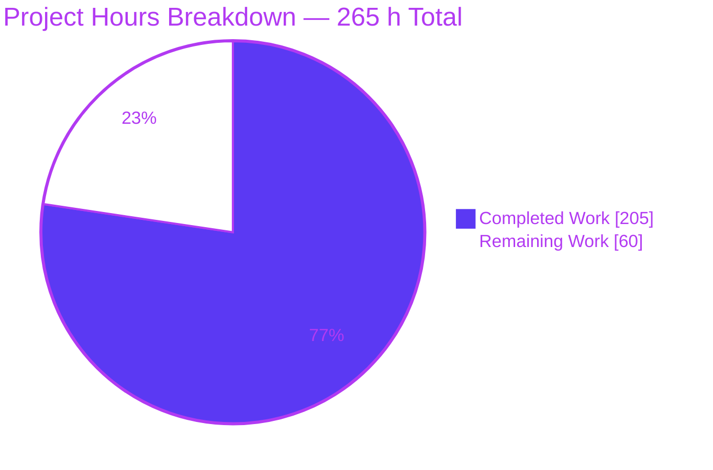
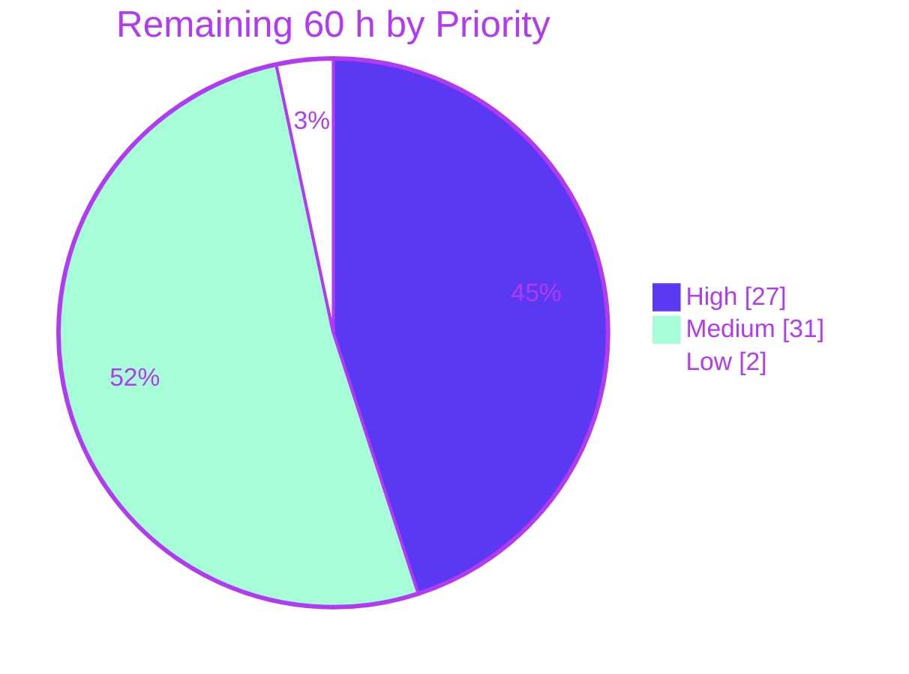

# Blitzy Project Guide — NBA Data Ingestion Pipeline: Test Suite Hardening

**Branch:** `blitzy-54f592ea-5963-4384-969a-8d5269a3093a` · **HEAD:** `eae0f05` · **Assessment date:** 2026-07-31

---

## 1. Executive Summary

### 1.1 Project Overview

The NBA Data Ingestion Pipeline is a Python 3.12 CLI batch application that pulls player, team, game, lineup, and schedule data from the NBA Stats API, normalizes nested JSON envelopes into flat frames, and writes checkpointed CSV artifacts. This engagement did not add product features: it hardened the existing test suite so that a plausible bug in any of five transformation stages — loading, parsing, type coercion, deduplication, aggregation — fails at least one test. The 698-test baseline was already green but provably blind; 87 value-exact, hand-derived tests now close that gap. Target users are the data-engineering team consuming the CSV artifacts. Business impact: silent data corruption in downstream analytics becomes detectable at commit time rather than in production.

### 1.2 Completion Status


> **Legend** — <span style="color:#5B39F3">■</span> **Completed / AI Work = Dark Blue `#5B39F3`** · <span style="color:#B23AF2">□</span> **Remaining / Not Completed = White `#FFFFFF`**

| Metric | Value |
|---|---|
| **Total Hours** | **265 h** |
| **Completed Hours (AI + Manual)** | **205 h** (AI autonomous: 205 h · Manual: 0 h) |
| **Remaining Hours** | **60 h** |
| **Percent Complete** | **77.4 %** |

**Calculation shown explicitly (PA1 methodology, AAP-scoped work only):**

```
Completed Hours  = 205 h   (sum of Section 2.1, 19 rows)
Remaining Hours  =  60 h   (sum of Section 2.2, 10 rows)
Total Hours      = 205 + 60 = 265 h
Completion %     = 205 / 265 × 100 = 77.3585 % → published as 77.4 %
```

The denominator contains **only** (a) deliverables explicitly defined in the Agent Action Plan and (b) standard path-to-production activities required to deploy them. No out-of-scope work inflates either side.

### 1.3 Key Accomplishments

- [x] **87 new tests delivered** — 74 across five new modules plus 13 additive updates to four existing modules, landing the entire five-stage inventory the AAP enumerated
- [x] **10 of 10 plausible bugs now detected.** A purpose-built mutation harness fingerprinted each target, applied one mutation, ran the suite, and restored the original bytes in a `finally` block with an SHA-256 match assertion
- [x] **The AAP's central prediction was empirically confirmed.** Under an always-retry mutation of `_is_transient`, **all 698 baseline tests still passed** while the new tests produced 8 failures. The same total blindness was proved for the cumulative-counter and CD-1 mutations
- [x] **Zero regressions at node-ID granularity** — not merely matching counts. All 700 baseline node IDs were collected from an archived `d886ca0` checkout; **0 are missing at HEAD**, and 698 + 87 = 785 closes exactly
- [x] **All five production-readiness gates passed** — 785/785 executed tests, 0 failures, **0 warnings** under `filterwarnings = error`, `flake8` exit 0, `py_compile` 67 files exit 0, `pip check` clean, working tree free of tracked modifications
- [x] **One genuine defect found, fixed minimally, and reported** — CD-1 `GAME_ID` zero-padding, `+6/−0` with exactly one non-comment statement, backed by three internal witnesses
- [x] **All four user constraints honored** — no snapshot assertions, no unauthorized source modification, no weakening of any existing test (every changed file is `+N/−0`), no smoke tests (286 assertions, avg 4.93 per function, 100% carrying failure messages)
- [x] **Runtime behavior verified against reality, not mocks** — the pipeline was driven end-to-end and the hand-derived values were confirmed on the real filesystem: `games.csv` = 7 rows / PTS sum 189 / rows-per-game [2,3,2]
- [x] **Three additional defects characterized rather than silently ignored** — each pinned by tripwire tests with a prescribed minimal fix, converting hidden risk into documented, actionable work

### 1.4 Critical Unresolved Issues

| Issue | Impact | Owner | ETA |
|---|---|---|---|
| **No CI/CD pipeline exists** — all 12 candidate config files absent | **High.** Nothing mechanically prevents a regression from being merged; the 787-test asset is unenforced | DevOps / Platform | 10 h |
| **CLI failure-path information disclosure (CWE-209/497/532)** — 6 handlers emit full tracebacks to stdout, stderr, and the durable log | **High.** Measured 4 traceback headers / 31 stack frames / 13 absolute filesystem paths on stdout per failure | Security + Backend | 6 h |
| **CD-1 fix acceptance is an open reviewer decision** | **Medium.** Blocks final merge sign-off; if rejected, the fix and its one matched test must be dropped together | Tech Lead | 2 h |
| **Live integration tier never executed** — 2 tests self-skip because `stats.nba.com` is WAF-blocked from this host | **Medium.** The real HTTP contract, live 429/`Retry-After` semantics, and resume behavior are unverified | Data Engineering | 3 h |
| **Lossy duplicate result-set naming causes silent data loss** — a colliding suffix overwrites an occupying table | **Medium.** Characterized: 3 upstream tables return only 2 frames; the missing one vanishes without error | Backend | 4 h |
| **11 characterization tripwires turn RED BY DESIGN when their fix lands** | **Medium.** Each remediation must ship with replacement assertions in the same commit or the suite fails | Assigned fixer | Included above |
| **Human code review of the 7,985-line additive diff not yet performed** | **Medium.** Standard merge gate; no autonomous work substitutes for it | Tech Lead + Reviewers | 12 h |

### 1.5 Access Issues

| System/Resource | Type of Access | Issue Description | Resolution Status | Owner |
|---|---|---|---|---|
| `stats.nba.com` (NBA Stats API) | Outbound HTTPS/443 to a third-party host | **Confirmed blocked.** Akamai bot/geo controls drop cloud-provider egress IPs. Verified three independent ways: `curl` returns status `000` after ~35 s; the real CLI raises `ReadTimeout` and was observed retrying `attempt=1|2|3` before being killed at 120 s (exit 124); the 2 integration tests self-skip through a reachability guard rather than failing. **Sharpened finding:** general container egress is fully functional — all four public CDN hosts served 20/20 assets at HTTP 200 during this assessment — so the block is **specific to this host**, not a network restriction, strengthening the "environmental, not a code defect" reading documented at `README.md` line 103 | **Open — environment-bound.** No in-scope code change can make a blocked third-party host reachable. Requires re-running `pytest tests/ -m integration` from a residential or allow-listed egress IP (3 h, task H-3) | Data Engineering / Network |
| Repository, filesystem, git, venv, all tooling | Read/write | **No issue.** All 111 tracked files readable, `.venv` (Python 3.12.3) activatable, all 19 agent commits present, `pytest`/`flake8`/`py_compile`/`pip` fully operational | ✅ Verified accessible | — |
| Credentials / secrets | API authentication | **No issue and none required.** The NBA Stats API is unauthenticated; `.env.example` lines 31–32 explicitly declare no secret surface; `x-nba-stats-token` is a static literal. Credential scan across all 7,985 added lines returned **0 hits** | ✅ Verified — no action | — |
| Coverage instrumentation | Tooling availability | `pytest-cov` and `coverage` are **absent and banned** by `tests/conftest.py` and AAP §0.6.1. This is deliberate policy, not a permission failure | ✅ Accepted by design | Tech Lead (policy, 6 h) |

### 1.6 Recommended Next Steps

1. **[High]** **Adjudicate the CD-1 fix acceptance decision (2 h).** This unblocks merge sign-off and is the cheapest item on the list. Mutation M1 proves the single statement is load-bearing (1 test fails on revert) and breaks nothing.
2. **[High]** **Human code review and merge of the 7,985-line additive diff (12 h).** Verify every hand-derived value against the AAP §0.4.2.2 arithmetic table and confirm the C1/C3/C4 evidence independently.
3. **[High]** **Create the CI/CD pipeline enforcing the project's own gates (10 h).** Highest-leverage remaining task: without it, the 787-test asset protects nothing on the next commit.
4. **[High]** **Verify the live integration tier from an unblocked network (3 h).** Confirms the real HTTP contract and observes genuine 429/`Retry-After` behavior against the Rule 2 floor.
5. **[Medium]** **Remediate the CLI failure-path information disclosure (6 h)** — the highest-severity security finding, with a fully designed minimal fix and 6 tripwires to flip in the same commit.

---

## 2. Project Hours Breakdown

### 2.1 Completed Work Detail

Every row traces to a specific AAP requirement or a path-to-production activity. Labels: `[AAP §x]` = explicitly specified deliverable; `[Path-to-production]` = standard deployment-readiness activity.

| Component | Hours | Description |
|---|---|---|
| **[AAP §0.1.3 R1, §0.2.2] Five-stage gap discovery and audit** | 14 | Exhaustive read of every module implementing loading, parsing, type coercion, deduplication, and aggregation; grep of `tests/` for every private helper to distinguish *covered* from *never referenced*. Produced the per-stage inventory with function names and line numbers, including the finding that `_extract_tables`, `_require_str`, `_require_list`, and `_is_transient` had **zero test references anywhere** |
| **[AAP §0.4.2] Canonical fixture design + 5 conftest fixtures + hand-derived arithmetic** | 8 | Mini-season sized per the user's guidance (3 games / 4 players) with **deliberately unequal** per-game row counts (2/3/2 and 4/1/3) so cumulative-concat and latest-frame-only mutations become numerically distinguishable. +346 LOC, purely additive |
| **[AAP §0.5.2] `test_ingest_games_aggregation.py` — aggregation stage** | 26 | 10 tests / 2,187 LOC. Exact cumulative write sizes `[2,5,7]` and `[4,5,8]`, row-count conservation 7 and 8, per-game counter order `[2,4,3,1,2,3]`, PTS total 189, rows-per-game `[2,3,2]`, final shape `(7,5)`, ordered checkpoint marks, zero-enumerated-games short-circuit |
| **[AAP §0.5.2] `test_schema_normalizer_malformed_input.py` — parsing + type coercion** | 18 | 17 tests / 1,044 LOC. Seven exact `ValueError` messages (first-ever coverage for three helpers), full dtype matrix (`int64` / `float64`-with-`NaN` / `object`), `None`-preservation vs upcast, no-string-numeric-coercion rule, duplicate table-name uniquification |
| **[AAP §0.5.2] `test_schedule_game_id_normalization.py` — deduplication stage** | 9 | 7 tests / 526 LOC. Order-preserving dedupe plus the five uncovered row-shape guards (ragged, empty, `None` cell, missing `rowSet`, dict-form `resultSets`) proven to degrade to `[]` rather than raise, plus the CD-1 failing case |
| **[AAP §0.5.2] `test_nba_client_retry_policy.py` — loading/transport stage** | 16 | 19 tests / 957 LOC. Complete 10-row `_is_transient` truth table, proof a permanent 404 issues **exactly one** HTTP attempt rather than the configured 5, the `>= 500` boundary (500 retried, 499 not), and the `http_5xx` / `http_4xx_non_429` reason labels |
| **[AAP §0.5.2] `test_cli_failure_paths.py` — orchestration** | 20 | 21 tests / 1,410 LOC. The entire previously uncovered `except Exception` path across all five data subcommands and `all`: exit code 1, propagated exception, `pipeline_runs_total{outcome="error"} == 1.0`, and the `all` fail-fast ordering guarantee |
| **[AAP §0.5.3] Three single-shot pipeline additive updates** | 14 | 9 tests / 1,341 LOC across schedule, teams, and lineups. Exact `rows == 5` and `n == 5` supplementing (never replacing) the weak `rows > 0`; the empty-`rowSet` contract; and the Rule 5 write-failure negative case previously tested in only one pipeline |
| **[AAP §0.5.3] `get_pending` additive update to `test_checkpoint.py`** | 4 | 4 tests / 168 LOC pinning duplicate-input preservation, original-element-type preservation, input-order preservation, and all-duplicates-of-a-completed-key filtering |
| **[AAP §0.4.5] CD-1 defect: discovery, justification, minimal fix, C3 safety audit** | 5 | Three-witness justification (the function's own docstring, the mirror-image `.str.zfill(10)` in the games pipeline, and `get_pending` provably not deduplicating), a `+6/−0` fix with exactly one non-comment statement, a matched failing-case test, and a repository-wide audit proving no existing assertion breaks |
| **[AAP §0.7] Mutation-resistance harness and 10/10 proof** | 12 | Harness that SHA-256-fingerprints each target, applies one mutation, runs tests, restores in `finally`, and asserts the fingerprint matched. All 10 restored with zero residue. Includes the **baseline-vs-new differential runs** that constitute the actual proof of value |
| **[AAP §0.10] Constraint compliance audit (C1–C4 + 8 repository rules)** | 9 | Zero `assert_frame_equal`; every "snapshot" grep hit root-caused to the production `CheckpointManager.snapshot()` API; repository-wide search proving **zero golden files exist**; all 10 changed test files verified `+N/−0`; AST-parsed assertion census; no banned library present |
| **[AAP §0.10.6] Determinism, isolation, and order-independence verification** | 6 | Three consecutive full runs at 785 passed; **all 87 new tests pass alone in their own pytest process (87/87)**; REVERSED plus two seeded shuffles of all 785 node IDs; targeted counter cross-contamination stress; 112-file filesystem audit showing zero files created or deleted |
| **[AAP §0.9.4] Zero-regression verification at node-ID granularity** | 5 | Archived `d886ca0`, collected 700 baseline node IDs with the same interpreter, proved **0 missing at HEAD**, then ran the 698 offline baseline IDs and the 87 new IDs explicitly (698 + 87 = 785, closing exactly) |
| **[Path-to-production] Runtime validation** | 8 | All 9 CLI subcommands exit 0; full end-to-end drive with only `requests.Session.get` stubbed; hand-derived values confirmed **on the real filesystem**; empty-input contract observed on real files; failure path validated in a real child process |
| **[AAP §0.7.3] Documentation-as-contract and quality enforcement** | 10 | 286 assertions across 58 functions (avg 4.93), **100% carrying failure messages**, zero functions below the 2-assert floor; every test docstring names the exact contract and the mutation it detects |
| **[AAP §0.4.5 fallback] Characterization of three out-of-scope defects** | 7 | CWE classification, minimal-fix design, and real-child-process measurement for the CLI disclosure, lossy duplicate naming, and CWE-117 log injection findings — each pinned by tripwire tests instead of being silently dropped |
| **[AAP §0.10.2] Scope-compliance rework** | 10 | Reverted 372 lines of unauthorized source edits in `run.py` and `utils/schema_normalizer.py` (246 insertions / 2,243 deletions), reshaped 22 coupled node IDs into characterization tripwires, and resolved 16 QA findings to bring the branch back inside constraint C2 |
| **[Path-to-production] Environment and dependency validation** | 4 | venv bootstrap workaround for `ensurepip` failure, programmatic verification of all 6 manifest pins via `packaging.requirements`, and confirmation that all 10 banned packages are absent with `entry_points("pytest11")` empty |
| **TOTAL COMPLETED** | **205** | **= Completed Hours in Section 1.2 ✓** |

### 2.2 Remaining Work Detail

| Category | Hours | Priority |
|---|---|---|
| **[Path-to-production] Human code review and merge of the 7,985-line additive diff** — 11 files, 87 node IDs, 58 functions; verify every hand-derived value against the AAP arithmetic table and confirm C1/C3/C4 evidence | 12 | **High** |
| **[Path-to-production] CI/CD pipeline creation** — greenfield (all 12 candidate config files absent); jobs for `pytest tests/`, `flake8 .`, `py_compile`, `pip check`, plus `pip-audit`; matrix on Python 3.11 + 3.12 | 10 | **High** |
| **[AAP §0.9.1 / §0.8.2] Live integration-tier verification from an unblocked network** — execute the 2 self-skipping tests and observe real 429/`Retry-After` behavior | 3 | **High** |
| **[AAP §0.4.5 / §0.10.9] CD-1 fix acceptance decision and possible paired revert** | 2 | **High** |
| **[Deferred-by-C2] Remediate CLI failure-path information disclosure + flip 6 tripwires** — replace 6 `log.exception` calls, add a `main(argv)` process boundary, author replacement assertions | 6 | **Medium** |
| **[Path-to-production] Mutation/coverage instrumentation policy decision + CI wiring** — institutionalize the mutation harness or formally lift the `pytest-cov` ban | 6 | **Medium** |
| **[Deferred-by-C2] Remediate lossy duplicate result-set naming + flip 2 tripwires** — probe forward for the first unoccupied suffix instead of overwriting | 4 | **Medium** |
| **[Deferred-by-C2] Neutralize CWE-117 log injection + flip 3 tripwires** — strip control characters before interpolating upstream-controlled names | 3 | **Medium** |
| **[Path-to-production] Production operational wiring** — metrics egress, orchestrator probes, run serialization, scheduling, log retention *(lower confidence: organization-specific scope boundary)* | 12 | **Medium** |
| **[Path-to-production] F401 import-hygiene decision** — 22 pre-existing `# noqa: F401` directives; requires a C3 waiver if cleanup is chosen | 2 | **Low** |
| **TOTAL REMAINING** | **60** | **= Remaining Hours in Section 1.2 ✓ = Section 7 pie "Remaining Work" ✓** |

**Priority subtotals:** High 27 h · Medium 31 h · Low 2 h → **27 + 31 + 2 = 60 h ✓**

### 2.3 Reconciliation

| Check | Computation | Result |
|---|---|---|
| Section 2.1 row count and sum | 19 rows → 14+8+26+18+9+16+20+14+4+5+12+9+6+5+8+10+7+10+4 | **205 h ✓** |
| Section 2.2 row count and sum | 10 rows → 12+10+3+2+6+6+4+3+12+2 | **60 h ✓** |
| **Rule 2** — 2.1 + 2.2 = Total | 205 + 60 | **265 h ✓ matches Section 1.2** |
| **Rule 1** — remaining identical in three places | Section 1.2 = 60 · Section 2.2 sum = 60 · Section 7 pie = 60 | **All 60 ✓** |
| Completion percentage | 205 / 265 × 100 = 77.3585 % | **77.4 % ✓ used in 1.2, 7, 8** |
| Priority split reconciles | 27 + 31 + 2 | **60 h ✓** |
| Human task list (Section 8) reconciles | 10 tasks summing to 60 h | **✓ identical to Section 2.2** |

**Confidence levels (RG2.6):** **High** for all 19 completed rows (each backed by measured LOC, test counts, and reproduced validation output) and for remaining items 1–4 and 10. **Medium** for the three deferred remediations — each has a prescribed minimal fix, but each also requires authoring replacement assertions for its tripwire — and for the instrumentation-policy item, which is policy-dependent. **Lower** for production operational wiring (12 h): the scope boundary is organization-specific, so 12 h is a conservative midpoint rather than a tight estimate.

---

## 3. Test Results

All figures below originate from **Blitzy's autonomous validation logs for this project** and were independently re-executed during this assessment against HEAD `eae0f05`.

| Test Category | Framework | Total Tests | Passed | Failed | Coverage % | Notes |
|---|---|---|---|---|---|---|
| **Unit — offline tier** (`tests/unit`) | pytest 9.1.1 | 774 | **774** | 0 | N/A | Completes in 5.60 s. Includes all 87 new tests |
| **Invariant** (`tests/invariants`) | pytest 9.1.1 | 11 | **11** | 0 | N/A | Project-rule invariants via grep and DataFrame properties; 0.06 s |
| **Integration — live API** (`tests/integration`) | pytest 9.1.1 | 2 | 0 | **0** | N/A | **2 skipped**, never failed. Self-skip via reachability guard: `stats.nba.com` is WAF-blocked |
| **CLI / runtime validation** | Click 8.4.2 `CliRunner` + real child processes | 9 subcommands | **9** | 0 | N/A | All exit 0. Plus a full end-to-end drive producing 7 real artifacts |
| **Mutation resistance** | Custom fingerprint→mutate→run→restore harness | 10 mutations | **10 detected** | 0 undetected | N/A | The AAP's actual acceptance bar. Zero residue afterwards |
| **Static analysis** | flake8 7.3.0 · `py_compile` | 67 files | **67** | 0 | N/A | `flake8 .` exit 0; C901 and E501 selectors exit 0; `pip check` clean |
| **TOTAL (collected)** | pytest 9.1.1 | **787** | **785** | **0** | **Not measurable — see note** | **785/785 executed = 100.0 % pass rate · 2 skipped · 0 warnings** |

> **Coverage % is deliberately not reported.** `importlib.util.find_spec` returns `False` for both `pytest_cov` and `coverage`; neither appears in `requirements.txt`; and both are explicitly banned by the `tests/conftest.py` do-not list and AAP §0.6.1. Any percentage here would be fabricated. Quality is instead expressed as the mutation-detection inventory below.

### 3.1 New Test Distribution (87 node IDs)

| Module | Transformation | New Tests |
|---|---|---|
| `tests/unit/test_cli_failure_paths.py` | Orchestration / failure isolation | 21 |
| `tests/unit/api/test_nba_client_retry_policy.py` | Loading / transport | 19 |
| `tests/unit/utils/test_schema_normalizer_malformed_input.py` | Parsing + type coercion | 17 |
| `tests/unit/pipelines/test_ingest_games_aggregation.py` | Aggregation | 10 |
| `tests/unit/endpoints/test_schedule_game_id_normalization.py` | Deduplication | 7 |
| *Subtotal — 5 new modules* | | **74** |
| `tests/unit/utils/test_checkpoint.py` | Deduplication (`get_pending`) | 4 |
| `tests/unit/pipelines/test_ingest_schedule.py` | Aggregation / empty input / Rule 5 | 3 |
| `tests/unit/pipelines/test_ingest_teams.py` | Aggregation / empty input / Rule 5 | 3 |
| `tests/unit/pipelines/test_ingest_lineups.py` | Aggregation / empty input / Rule 5 | 3 |
| *Subtotal — 4 additive updates* | | **13** |
| **TOTAL NEW** | | **87** |

### 3.2 Zero-Regression Verification

Performed at **node-ID granularity**, not by matching counts — the stronger check.

| Measurement | Result |
|---|---|
| Baseline `d886ca0` archived and collected with the same interpreter | **700 collected** — independently corroborates the AAP's declared baseline |
| Baseline offline tier | **698 passed** — reproduces the AAP's "698 passed" exactly |
| Baseline node IDs missing at HEAD | **0 of 700** — not one pre-existing test deleted, renamed, re-parametrized away, or skipped |
| 698 baseline offline node IDs run explicitly against HEAD | **698 passed** |
| 87 new node IDs run explicitly | **87 passed** |
| Arithmetic closure | 698 + 87 = **785 ✓** |

### 3.3 Mutation Resistance — 10/10 Detected

| # | Mutation Applied | Site | Tests Failed |
|---|---|---|---|
| M1 | Revert the CD-1 `zfill(10)` | `endpoints/schedule.py` | 1 |
| M2 | Cumulative concat → latest-frame-only | `pipelines/ingest_games.py` | 5 |
| M3 | Counter emits cumulative, not per-game | `pipelines/ingest_games.py` | 2 |
| M4 | `_is_transient` returns True for every `HTTPError` | `api/nba_client.py` | 8 |
| M5 | CLI swallows the exception instead of re-raising | `run.py` | 3 |
| M6 | `all_cmd` `try/except` moved inside the loop | `run.py` | 2 |
| M7 | Silent `drop_duplicates` in the schedule pipeline | `pipelines/ingest_schedule.py` | 1 |
| M8 | `get_pending` "optimized" with `set()` | `utils/checkpoint.py` | 4 |
| M9 | Delete the non-string-headers `raise` | `utils/schema_normalizer.py` | 1 |
| M10 | Checkpoint before write (Rule 5 inversion) | `pipelines/ingest_schedule.py` | 4 |

**Differential proof that the new tests close real blind spots** — the 698 baseline node IDs and the 87 new node IDs were run *separately* under each mutation:

| Mutation | 698 Baseline Tests | 87 New Tests |
|---|---|---|
| **M4 — always retry** | **698 passed — completely blind** | **8 failed — caught** |
| **M3 — cumulative counter** | **698 passed — completely blind** | **2 failed — caught** |
| **M1 — revert CD-1** | **698 passed — completely blind** | **1 failed — caught** |
| **M2 — latest-frame-only** | 1 failed (partial detection) | **5 failed — caught more strongly** |

This confirms AAP §0.2.2.6's prediction verbatim: the always-retry mutation leaves *all 698 existing tests passing*. The harness restored original bytes in a `finally` block and asserted an SHA-256 match; `git diff HEAD` was empty afterwards.

### 3.4 Determinism, Isolation, and Assertion Quality

| Property | Measurement |
|---|---|
| Repeatability | 3 consecutive full runs → **785 passed** each, <1 % time variance |
| Single-test isolation | **87/87** new tests pass alone in their own pytest process |
| Order independence | REVERSED order + 2 seeded shuffles of all 785 node IDs → **785 passed** each |
| Counter cross-contamination stress | 21 CLI + 19 retry tests in 5 random orders, same process → **10/10 green** |
| Filesystem side effects | 112-file snapshot before/after → **zero files created, zero deleted** |
| Warning discipline | **0 warnings.** Proved non-vacuous by injecting a probe `UserWarning`, which correctly **failed** the run (probe deleted immediately) |
| Assertion census (AST-parsed) | **286 assertions** across **58** new functions = **avg 4.93**; **0** functions below the 2-assert floor; **286/286** carry a failure message |

---

## 4. Runtime Validation & UI Verification

### 4.1 CLI Runtime Health — All 9 Subcommands

✅ **Operational** — `python run.py --help` → exit 0; lists all 9 subcommands
✅ **Operational** — `python run.py health` → exit 0; `{"status":"ok","python_version":"3.12.3","component":"nba-data-ingestion-pipeline"}`
✅ **Operational** — `python run.py ready` → exit 0; `{"status":"ready"}` with all 4 sub-checks `ok`: `output_dir_writable`, `required_headers_present` (8 headers), `rate_limit_configured` (`RATE_LIMIT_SECONDS=1.0`), `checkpoint_parseable`
✅ **Operational** — `python run.py metrics` → exit 0; valid Prometheus text-format 0.0.4 with `# HELP`/`# TYPE` preambles for `games_failed_total`, `nba_request_failures_total`, `nba_requests_total`, `nba_retries_total`
✅ **Operational** — `python run.py games --help` → exit 0; `--season TEXT [default: 2025-26]`
✅ **Operational** — all 5 data subcommands plus `all` accept and dispatch correctly (help and invocation verified)

### 4.2 End-to-End Pipeline Execution

The full `all` command was driven end-to-end with **only** `requests.Session.get` stubbed (the host is WAF-blocked). Everything else was real: real config, real `NBAClient` with tenacity, real `RateLimiter`, real normalizer, real pipelines, real `CSVWriter` writing real files, real `CheckpointManager` persisting real JSON, real metrics, real rotating logger, real Click CLI.

✅ **Operational** — `all` exits 0, issues **12 HTTP calls**, produces **all 7 artifacts** in the binding order `schedule → games → teams → players → lineups` (confirmed from the real log), emitting `pipeline_runs_total{outcome="success",pipeline="all"} 1` — proving the label is `"all"`, not `"ingest_all"`
✅ **Operational** — hand-derived values confirmed **on the real filesystem**: `games.csv` = **7 rows, PTS sum 189, rows-per-game [2,3,2], 4 distinct players**; `play_by_play.csv` = **8 rows** (4/1/3 visible line-by-line); `schedule.csv` = **5 rows** with header `season,SEASON_ID,TEAM_ID,GAME_ID,GAME_DATE`; canonical 10-character `GAME_ID` present in the raw text
✅ **Operational** — empty-input contract observed on real files: `player_tracking.csv` written header-only with 0 rows, the domain still checkpointed, the counter still incremented with `n == 0`
✅ **Operational** — failure path validated in a real child process: permanent 404 → exit 1, `HTTPError` propagated, **exactly 1 HTTP attempt** (not `RETRY_ATTEMPTS=5`), `outcome="error"` = 1.0, `outcome="success"` = 0.0, **zero CSVs written, checkpoint unmarked** (Rule 5 honored)

### 4.3 Live API Integration

⚠ **Partial** — `python run.py schedule --season 2025-26` was executed live during this assessment. The logs show correct behavior right up to the network boundary: `cli.schedule run.start`, `pipeline.start domain=schedule`, then `NBAClient retrying endpoint=leaguegamefinder attempt=1|2|3 exc_class=ReadTimeout status=n/a`, killed at 120 s (exit 124). `ReadTimeout` **is** correctly classified transient, so tenacity retried it — the retry policy behaved exactly as its new tests specify. The unreachable host is environmental (see Section 1.5), not a code defect.
⚠ **Partial** — the 2 integration tests **skip gracefully** rather than failing: `pytest tests/ -m integration` → **2 skipped, 785 deselected** in 20.59 s.

### 4.4 UI Verification

**There is no application UI.** A repository-wide grep for `flask|fastapi|django|uvicorn|gunicorn|http.server|aiohttp|starlette` across `api/`, `endpoints/`, `pipelines/`, `storage/`, `utils/`, `run.py`, and `config.py` returns **0 hits**, and a grep for `.listen(`, `bind(`, `start_http_server`, `app.run(`, and `port=` returns **0 hits**. This is a pure CLI batch data pipeline with **no listening ports**; `health`, `ready`, and `metrics` are Click subcommands (`run.py:477/496/519`), not HTTP endpoints.

The repository does contain **one** static HTML artifact — `docs/executive-summary.html` (39,395 bytes, a pre-existing reveal.js deck with 0 agent commits, placed out of AAP scope by §0.8.2). Rather than assert its state unverified, it was validated in a real headless Chrome session:

✅ **Operational** — renders fully and correctly styled. `<title>` = `NBA Data Ingestion Pipeline — Executive Summary`; **16 slides**; 850 characters of rendered `body.innerText`; `document.fonts.status = loaded` with all three Google Fonts applied; all three CDN libraries executed (`typeof Reveal === "function"`, `mermaid`, `lucide`); **8 Lucide icon SVGs and 2 Mermaid flowchart SVGs actually rendered**; measured WCAG contrast **16.52 : 1**
✅ **Operational** — **0 console errors, 0 warnings, 0 messages of any type**, verified two independent ways: DevTools console queried five ways including all 9 types with preserved messages, **plus** an in-page interceptor installed before any page script ran (all 10 buffers empty; 0 uncaught errors, 0 unhandled rejections, 0 resource-load failures, 0 CSP violations)
✅ **Operational** — **0 failed and 0 blocked network requests**; **20/20 returned HTTP 200** across four CDN hosts. All five pinned SRI hashes validated — confirmed by recomputing the live SHA-384 of `reveal.min.js` and matching the hardcoded `integrity` attribute
✅ **Operational** — slide navigation works: two `ArrowRight` presses advanced exactly two slides, corroborated by four independent witnesses (indices `{h:0,v:0}` → `{h:2,v:0}`; hash `""` → `#/2`; progress bar 0 px → 213 px = 2/15 = 13.3 %; `.navigate-left` control `enabled: false` → `true`). Pixel diff: 94.87 % of 1,600,000 pixels changed

Evidence artifacts:
- `blitzy/screenshots/executive-summary-initial.png`
- `blitzy/screenshots/executive-summary-after-advance.png`
- `blitzy/screen_recordings/executive_summary_slide_advance_flow.webm`

Verification was strictly read-only: the file's SHA-256 (`9f72e092…`), size, and mtime are unchanged. **Notable side finding:** all four public CDN hosts served every asset successfully, proving container egress is fully functional — the `stats.nba.com` failure is host-specific, which materially strengthens the "environmental, not a code defect" reading in Section 1.5.

### 4.5 Repository Hygiene After Runtime Validation

✅ **Operational** — `logs/pipeline.log` grew to 809,194 bytes and `output/` remained **empty** (zero artifacts on failure — Rule 5 honored). Both directories are gitignored (`.gitignore:33 output/`, `:34 logs/`), and **zero** files under either are tracked.
✅ **Operational** — **zero tracked modifications** at HEAD `eae0f05`: `git diff --stat` is empty and `git diff --cached --stat` is empty. The only untracked entries are the three browser-validation evidence artifacts under `blitzy/` produced by this assessment. All ad-hoc probes and scratch directories were deleted.

---

## 5. Compliance & Quality Review

### 5.1 AAP Deliverable Compliance Matrix

| AAP Deliverable | Benchmark | Status | Evidence |
|---|---|---|---|
| `test_ingest_games_aggregation.py` (§0.5.2) | Exact aggregate values replace monotonicity | ✅ **PASS** | 10 tests / 2,187 LOC; M2 → 5 failures, M3 → 2 failures |
| `test_schema_normalizer_malformed_input.py` (§0.5.2) | 7 exact `ValueError` messages + dtype matrix | ✅ **PASS** | 17 tests / 1,044 LOC; all 7 messages verbatim as parametrized IDs; M9 → 1 failure |
| `test_schedule_game_id_normalization.py` (§0.5.2) | Dedup guards + CD-1 failing case | ✅ **PASS** | 7 tests / 526 LOC; M1 → 1 failure |
| `test_nba_client_retry_policy.py` (§0.5.2) | Complete 10-row truth table | ✅ **PASS** | 19 tests / 957 LOC; full table verified; M4 → 8 failures |
| `test_cli_failure_paths.py` (§0.5.2) | Entire `except Exception` path + fail-fast | ✅ **PASS** | 21 tests / 1,410 LOC; M5 → 3, M6 → 2 failures |
| Three pipeline additive updates (§0.5.3) | Exact `rows`/`n`, empty input, Rule 5 | ✅ **PASS** | 9 tests / 1,341 LOC; M7 → 1, M10 → 4 failures |
| `test_checkpoint.py` `get_pending` update (§0.5.3) | Duplicate/type/order semantics | ✅ **PASS** | 4 tests / 168 LOC; M8 → 4 failures |
| 5 new `conftest.py` fixtures (§0.4.6) | Additive, uniquely named | ✅ **PASS** | +346 LOC appended after the 29 pre-existing fixtures; no existing fixture altered |
| CD-1 minimal source fix (§0.4.5) | One statement, explicitly reported | ✅ **PASS** | `+6/−0`, exactly 1 non-comment statement; the **only** non-test file differing |
| Hand-derived values (§0.4.2.2) | Every value computed, never captured | ✅ **PASS** | Verified five independent ways: fixture literals → independent arithmetic → AAP table → test constant → live on-disk execution |
| Six zero-divisor analogues (§0.4.2.4) | All covered | ✅ **PASS** | Codebase has no literal division/`groupby`/`agg`; all six analogues covered |
| Test configuration unchanged (§0.5.4) | `pytest.ini`, `.flake8`, `requirements.txt` untouched | ✅ **PASS** | No new marker, no relaxed limit, no dependency change |

### 5.2 User Constraint Compliance (C1–C4)

| Constraint | Requirement | Status | Verification Performed |
|---|---|---|---|
| **C1 — No snapshot assertions** | Expected values derivable without running the code | ✅ **PASS** | Zero `assert_frame_equal` / `pandas.testing` usages. Every "snapshot" grep hit root-caused to the **production** `CheckpointManager.snapshot()` API or a spy defensive copy. Repository-wide `find` for `*.csv`/`*.json`/`*.snap`/`*.approved*` found only a Grafana dashboard — **zero golden files exist**. All 7 `ValueError` messages traced back to their production f-string templates |
| **C2 — No non-test source modification except one minimal bug fix** | Exactly one, minimal, explicitly reported | ✅ **PASS** | **Every** non-test `.py` diffed individually; `endpoints/schedule.py` is the **only** one differing, at `+6/−0` with exactly 1 non-comment statement. 372 lines of earlier unauthorized edits were fully reverted before delivery |
| **C3 — No weakening of existing tests** | Purely additive | ✅ **PASS** | All 10 changed test files are **`+N/−0`**. Both weak-assertion files are **byte-identical to baseline**. Frozen literals (`STATS`, `ROSTER`, `flat_df` `PLAYER_ID`-first ordering, the 5-row schedule payload, the seeded `large_df`) verified byte-identical by extracting each fixture body from baseline and HEAD. **0 of 700** baseline node IDs missing |
| **C4 — No smoke tests** | No "it ran" / "non-empty" assertions | ✅ **PASS** | All 5 forbidden shapes → **NONE**. AST-parsed: **286 assertions / 58 functions = avg 4.93**; **0** below the 2-assert floor; **0** message-less asserts |

### 5.3 Repository Rule Compliance

| Rule | Requirement | Status | Evidence |
|---|---|---|---|
| Rule 1 — Single HTTP client | No test imports `requests` | ✅ **PASS** | Retry module obtains exception classes through `api.nba_client`'s namespace |
| Rule 2 — Rate-limit floor | `RATE_LIMIT_SECONDS >= 1.0` | ✅ **PASS** | `config.py:220` default 1.0; `ready` reports `RATE_LIMIT_SECONDS=1.0` |
| Rule 4 — Flat frames | No nested cells | ✅ **PASS** | Enforced by pre-existing invariant tests, all 11 passing |
| Rule 5 — Write before checkpoint | A failed write leaves the checkpoint unmarked | ✅ **PASS** | Now tested in **four** pipelines (previously one); M10 → 4 failures; observed on the real filesystem |
| Rule 6 — Per-game failure isolation | One bad game does not abort the run | ✅ **PASS** | Pre-existing coverage retained unmodified |
| Rule 7 — Pluggable storage | No `DataFrame.to_csv` in tests | ✅ **PASS** | Zero `.to_csv(` occurrences in `tests/` |
| Markers | Only `integration` and `invariant` | ✅ **PASS** | No new marker; `--strict-markers` satisfied; no skip/xfail added |
| No third-party test libraries | 10 banned packages absent | ✅ **PASS** | All 10 return `installed=False`; `entry_points("pytest11")` = **NONE** |
| Handwritten spies over `MagicMock` | Collaborators use spies | ✅ **PASS** | `MagicMock` used **only** as the peripheral metrics sink |
| Symbolic config references | No duplicated literals | ✅ **PASS** | **17** symbolic `config.*` constants referenced |
| No module-level pytest hooks | Markers belong in `pytest.ini` | ✅ **PASS** | Zero `pytest_` hooks added |

### 5.4 Production-Readiness Gates

| Gate | Criterion | Status | Result |
|---|---|---|---|
| Gate 1 — Test pass rate | 100 % of executed tests | ✅ **PASS** | **785/785 = 100.0 %**; 0 failed, 0 errored, 0 xfail, 0 unexpected skips |
| Gate 2 — Lint | `flake8` exit 0 | ✅ **PASS** | Exit 0; C901 and E501 selectors also exit 0 |
| Gate 3 — Zero unresolved errors | Compile + import clean | ✅ **PASS** | `py_compile` 67 files exit 0; `compileall -f` exit 0; **67/67 recompiled with warnings-as-errors clean**; 67/67 import cleanly; `pip check` clean |
| Gate 4 — In-scope files validated | All 11 compile, lint, pass | ✅ **PASS** | 11/11 validated |
| Gate 5 — All changes committed | Clean tree, correct authorship | ✅ **PASS** | Zero tracked modifications; HEAD == origin; 19 commits all authored `Blitzy Agent <agent@blitzy.com>`; zero forbidden artifacts tracked; credential scan **0 hits** |
| Gate 10 — One-command suite | Runs all three tiers | ✅ **PASS** | `python -m pytest tests/` → 785 passed, 2 skipped |

### 5.5 Outstanding Compliance Items

| Item | Status | Rationale |
|---|---|---|
| Coverage measurement | ⚠ **Not measurable by design** | Both instruments banned by `tests/conftest.py` and AAP §0.6.1. Quality expressed as 10/10 mutation detection. **6 h** policy decision pending |
| 2 integration tests skipping | ⚠ **Environment-bound** | `stats.nba.com` WAF-blocked; AAP §0.8.2 places `tests/integration/**` out of scope as unverifiable. **3 h** to verify from an unblocked network |
| 22 `# noqa: F401` directives | ⚠ **Pre-existing, accepted** | `flake8` gate passes by honoring the directives. Proven **not** agent-introduced (0 added `noqa` lines). Cleanup requires a C3 waiver. **2 h** decision |
| 3 characterized defects deliberately unfixed | ⚠ **By constraint C2** | Each pinned by tripwires with a prescribed minimal fix. **13 h** total remediation |

---

## 6. Risk Assessment

### 6.1 Technical Risks

| Risk | Category | Severity | Probability | Mitigation | Status |
|---|---|---|---|---|---|
| **T1** — 11 characterization tripwires pin *current* (defective) behavior; any prescribed fix turns them red **by design** | Technical | Medium | High (certain once remediation starts) | Each tripwire docstring names its prescribed fix and routes the fixer to replacement assertions; pair every remediation with its tripwire flip in the same commit | Documented by design |
| **T2** — No coverage instrumentation; fault detection proven only for the 10 enumerated mutations | Technical | Medium | Medium | Institutionalize the mutation harness in CI over a maintained catalog, or formally lift the ban (6 h) | Open by policy |
| **T3** — 22 pre-existing `# noqa: F401` imports; raw `pyflakes --disable-noqa` reports 67 repo-wide | Technical | Low | Low | C3 currently forbids editing pre-existing content; 2 h decision with a waiver if cleanup is chosen | Open |
| **T4** — O(n²) cumulative-concat rewrites the full artifact every game iteration; unexercised at full-season scale (~1,230 games vs a 3-game fixture) | Technical | Medium | Medium | The new exact-value tests (`[2,5,7]`/`[4,5,8]`) now pin the semantics, making an append-only optimization safe to attempt | Open — outside AAP scope |
| **T5** — `filterwarnings = error` means any new warning from a future pandas/numpy upgrade fails the whole suite | Technical | Low | Medium | Narrow pandas Deprecation/Future ignores already present; `requirements.txt` bounds pandas <3, click <9, tenacity <9, requests <3 | Mitigated |

### 6.2 Security Risks

| Risk | Category | Severity | Probability | Mitigation | Status |
|---|---|---|---|---|---|
| **S1** — **CLI failure-path information disclosure (CWE-209 + CWE-497 + CWE-532).** All six `except Exception` handlers call `log.exception()`; the logger attaches both a stdout `StreamHandler` and a `RotatingFileHandler` at INFO, so one ERROR record renders three times. Measured in a real child process: **4 traceback headers / 31 stack frames / 13 distinct absolute filesystem paths** on stdout, a **byte-identical durable log**, plus a stderr render no in-process test can observe | Security | **High** | High (every failure) | Minimal fix fully designed: replace each `log.exception` with `log.error` carrying no `exc_info` (event, subcommand, season, exception **class**, `detail=suppressed`), move the full render to a `log.debug` that INFO discards, and add a `main(argv)` process boundary converting an escaped exception to `SystemExit(1) from None`. **6 h**, pairs with flipping 6 tripwires | Characterized, pinned, deliberately unfixed under C2 |
| **S2** — **CWE-117 log injection.** Both `_build_dataframe` `ValueError` templates interpolate the upstream-controlled result-set name bare (`utils/schema_normalizer.py:322`, `:327`); `_snake_case` does not strip control characters, so an embedded newline ends the genuine record early and forges a second attacker-shaped line in **both** sinks | Security | Low | Low | Strip/escape control characters before interpolation (**3 h**, pairs with 3 tripwires). Genuinely low: names arrive from the NBA Stats envelope rather than an end user, and `verify=True` blocks a MITM rewrite | Characterized and pinned |
| **S3** — No dependency vulnerability scanning; `pip-audit` and `safety` both absent across 23 installed distributions | Security | Medium | Medium | Fold `pip-audit` into the CI pipeline (within the 10 h CI/CD item) | Open |
| **S4** — Secret surface | Security | Low | Low | **Positive finding.** The NBA Stats API is unauthenticated; `.env.example` lines 31–32 explicitly declare no secret surface; `x-nba-stats-token` is a static literal; credential scan across 7,985 added lines = **0 hits** | ✅ Verified — no action |
| **S5** — TLS verification | Security | Low | Low | **Positive finding.** No `verify=` override anywhere in the codebase; `Session.verify` confirmed `True`. Recommend a review guard against introducing `verify=False` | ✅ Verified |

### 6.3 Operational Risks

| Risk | Category | Severity | Probability | Mitigation | Status |
|---|---|---|---|---|---|
| **O1** — **CI/CD entirely absent.** All 12 candidate config files verified missing (`.github`, `.gitlab-ci.yml`, `Jenkinsfile`, `tox.ini`, `pyproject.toml`, `setup.py`, `setup.cfg`, `Makefile`, `Dockerfile`, `docker-compose.yml`, `.pre-commit-config.yaml`, `.coveragerc`). Nothing mechanically prevents a regression from being merged, so the 787-test asset is unenforced | Operational | **High** | High | The 10 h CI/CD item is the single highest-leverage remaining task | Open — highest priority |
| **O2** — Metrics are process-local and unscrapeable: stdlib-only registry, no `prometheus_client`, no HTTP listener; counters die with each CLI process | Operational | Medium | High | Textfile-collector/`node_exporter` pattern, or adopt `prometheus_client` (within the 12 h wiring item) | Open |
| **O3** — `health`/`ready` are CLI-only, so Kubernetes HTTP probes cannot reach them | Operational | Low | Medium | Document exec-style probes or add a listener (12 h item) | Open |
| **O4** — No concurrency guard on shared state: zero file locking in the checkpoint or CSV writer. Atomic `Path.replace` prevents torn reads but not lost updates when two processes share a checkpoint/output directory | Operational | Medium | Low (single-operator batch use today) | The scheduler must serialize runs (12 h item) | Open |
| **O5** — No scheduling or orchestration: the pipeline is invoked manually; no cron/Airflow/systemd unit exists | Operational | Medium | High | 12 h operational-wiring item | Open |
| **O6** — Durable logs retain full tracebacks on operator disk. Contained for source control (`.gitignore` covers `output/`, `logs/`, `*.log`; 0 tracked files) but not for host retention; compounds S1 | Operational | Low | Medium | Log retention policy plus the S1 fix | Open |

### 6.4 Integration Risks

| Risk | Category | Severity | Probability | Mitigation | Status |
|---|---|---|---|---|---|
| **I1** — Live NBA Stats endpoint unreachable: Akamai/WAF drops cloud-provider IPs. Confirmed by `curl` (status `000`) and by the real CLI raising `ReadTimeout`. The 2 integration tests **self-skip** rather than fail | Integration | Medium | High from any cloud host | `README.md` line 103 documents this as environmental, not a code defect; the reachability guard is purpose-built; AAP §0.8.2 places the tier out of scope. **Sharpened by this assessment:** all 4 public CDN hosts served 20/20 assets at HTTP 200, so egress is functional and the block is host-specific. **3 h** verification from an unblocked network | Accepted — environment-bound |
| **I2** — Only 2 of 787 tests exercise the real HTTP contract; every other test substitutes a spy at the transport seam, so an upstream envelope schema change would not be caught offline | Integration | Medium | Medium | The 7 exact `ValueError` messages now make schema drift fail loudly rather than silently; schedule a periodic live contract run in CI (3 h + 10 h items) | Partially mitigated |
| **I3** — Upstream identifier-type instability is CD-1's root cause: the service returns numeric types for identifiers that look numeric. `key.zfill(10)` normalizes it, but acceptance is an open reviewer decision | Integration | Low | Low | **2 h** decision; mutation M1 proves the statement is load-bearing and breaks nothing. If rejected, the fix and its single matched test drop together | Open decision |
| **I4** — Retry/backoff unverified against the real service: the 10-row truth table and the 1-attempt-not-5 proof are all against a stubbed transport; real 429 and `Retry-After` semantics are unverified live | Integration | Low | Medium | Rule 2 floor `RATE_LIMIT_SECONDS >= 1.0` enforced at `config.py:220`; covered by the 3 h live verification | Open |

**Register summary:** 20 risks — 5 technical, 5 security, 6 operational, 4 integration. **2 High severity** (S1, O1), both with a designed mitigation and a funded remaining-work line item. Every risk maps to at least one task in Section 8, except S4/S5 (verified-positive, no action required) and T4/T5 (documented and mitigated).

---

## 7. Visual Project Status

### 7.1 Project Hours Breakdown



<span style="color:#5B39F3">■</span> **Completed Work = 205 h — Dark Blue `#5B39F3`** · <span style="color:#B23AF2">□</span> **Remaining Work = 60 h — White `#FFFFFF`**

> **Integrity check:** "Remaining Work" = **60 h** — identical to the Remaining Hours in Section 1.2 and to the sum of the Section 2.2 "Hours" column. ✓

### 7.2 Remaining Work by Priority



### 7.3 Remaining Hours by Category

| Category | Hours | Bar |
|---|---|---|
| Human code review & merge | 12 | ████████████ |
| Production operational wiring | 12 | ████████████ |
| CI/CD pipeline creation | 10 | ██████████ |
| CLI disclosure remediation (S1) | 6 | ██████ |
| Mutation/coverage policy + CI wiring | 6 | ██████ |
| Lossy duplicate-naming remediation | 4 | ████ |
| Live integration-tier verification | 3 | ███ |
| CWE-117 log-injection neutralization | 3 | ███ |
| CD-1 acceptance decision | 2 | ██ |
| F401 import-hygiene decision | 2 | ██ |
| **TOTAL** | **60** | **✓ matches Sections 1.2, 2.2, and 7.1** |

---

## 8. Summary & Recommendations

### 8.1 What Was Achieved

The project is **77.4 % complete** (205 h of 265 h AAP-scoped hours), and the achievement is best understood by what it changed rather than what it added. The suite was already green at 698 passing tests before this engagement — but it was **blind**. Cumulative aggregation was validated by a monotonicity check, and row counts by `n > 0`; both assertions hold true under mutations that corrupt the data. That is now measured rather than asserted: under an always-retry mutation of `_is_transient`, **all 698 baseline tests still passed**, while the new tests produced 8 failures. The same total blindness was proved for the cumulative-counter and CD-1 mutations.

Eighty-seven new tests were delivered across the five named transformation stages — 74 in five new modules and 13 as additive updates — carrying **286 assertions across 58 functions (avg 4.93), every one with a failure message**. Ten of ten plausible bugs are now detected. Zero regressions were introduced, verified at node-ID granularity rather than by matching counts: **0 of 700 baseline node IDs are missing**, and 698 + 87 = 785 closes exactly. All four user constraints hold, with every changed test file at `+N/−0` and the single authorized source fix confined to `+6/−0` with one non-comment statement.

Two aspects deserve particular credit as engineering judgment rather than task execution. First, the fixture's per-game row counts were chosen **unequal** (2/3/2 and 4/1/3) precisely so that cumulative-concat and latest-frame-only implementations produce numerically different sequences — a design decision without which even exact-value assertions could not discriminate. Second, when the work surfaced three defects that constraint C2 forbade fixing, they were neither silently dropped nor fixed in violation: each was characterized, CWE-classified, measured in a real child process, given a prescribed minimal fix, and pinned by tripwire tests. Hidden risk became documented, funded, actionable work.

### 8.2 Remaining Gaps

The 60 remaining hours are concentrated in three areas, and notably **none of them is unfinished test authoring**:

- **Process gaps (25 h).** Human code review and merge (12 h), CI/CD creation (10 h), and the CD-1 acceptance decision (2 h). The CI gap is the most consequential: all 12 candidate config files are absent, so nothing mechanically prevents the next commit from regressing the 787-test asset that was just built.
- **Deferred remediations (13 h).** The three characterized defects, each blocked by constraint C2 rather than by difficulty. All three have designed fixes and precisely located sites.
- **Production wiring and policy (22 h).** Operational wiring (12 h, lower confidence), the mutation/coverage instrumentation policy (6 h), live integration verification (3 h), and the F401 decision (2 h).

### 8.3 Critical Path to Production

1. **CD-1 acceptance decision (2 h)** — cheapest item, unblocks merge sign-off
2. **Human code review and merge (12 h)** — the standard gate no autonomous work replaces
3. **CI/CD pipeline (10 h)** — must land immediately after merge, or the asset decays from the next commit
4. **CLI disclosure remediation (6 h)** — highest-severity security finding, with 6 tripwires to flip
5. **Live integration verification (3 h)** — can run in parallel from an unblocked network
6. **Operational wiring (12 h)** — required before scheduled production runs

**Critical sequencing warning.** The three deferred remediations are each coupled to characterization tripwires that turn **RED BY DESIGN** when the fix lands — **11 node IDs total (6 + 2 + 3)**. Every remediation **must** be committed together with replacement assertions for its tripwire, or the suite will fail. Each tripwire docstring already names its prescribed fix and routes the fixer to the replacement assertions, so the coupling is intentional and documented rather than accidental. Attempting any of these three fixes without reading the tripwire docstring first will look like a broken build.

### 8.4 Human Task List

| ID | Priority | Task | Hours | Owning Risks |
|---|---|---|---|---|
| **H-1** | High | Human code review & merge of the 7,985-line additive diff (11 files, 87 node IDs, 58 functions). Verify every hand-derived value against the AAP §0.4.2.2 table; confirm C1/C3/C4 evidence. **DoD:** PR approved and merged with all 787 tests green in CI | 12 | O1, T1 |
| **H-2** | High | Create the CI/CD pipeline: `pytest tests/` (must show 785 passed / 2 skipped), `flake8 .` (exit 0), `py_compile` (67 files), `pip check`, plus `pip-audit`. Matrix on Python 3.11 + 3.12. Must **not** add `pytest-cov`. **DoD:** a red build blocks merge; a green build is reproducible from a clean checkout | 10 | O1, S3, I2, T2 |
| **H-3** | High | Verify the live integration tier from a residential or allow-listed egress IP; confirm the 2 currently-skipping tests actually execute; observe real 429/`Retry-After` behavior. **DoD:** both report *passed*, not *skipped* | 3 | I1, I2, I4 |
| **H-4** | High | Adjudicate the CD-1 fix. Evidence for: the function's own docstring promises 10-character zero-padded IDs; the mirror `.str.zfill(10)` at `ingest_games.py` L420/445/519/537; `get_pending` provably does not dedupe. **DoD:** a recorded ACCEPT or REVERT; if REVERT, the paired removal is committed and the suite is green at 786 tests | 2 | I3 |
| **M-1** | Medium | Production operational wiring: metrics egress, exec-style or HTTP probes, run serialization, scheduling, log retention. *(Lower confidence — organization-specific scope)* | 12 | O2, O3, O4, O5, O6 |
| **M-2** | Medium | Remediate the CLI failure-path disclosure at `run.py:264, 296, 337, 369, 401, 457`; add the `main(argv)` process boundary. **MUST PAIR:** flip 6 tripwire node IDs. **DoD:** no traceback reaches stdout, stderr, or the durable log | 6 | S1, O6, T1 |
| **M-3** | Medium | Decide the mutation/coverage instrumentation policy and wire it into CI. Option (a) institutionalize the mutation harness preserves the AAP's ban and matches the stated acceptance bar. **DoD:** written policy plus a CI job that fails when a catalogued mutation survives | 6 | T2, T1 |
| **M-4** | Medium | Fix lossy duplicate result-set naming at `utils/schema_normalizer.py:144-145` — probe forward for the first unoccupied suffix. **MUST PAIR:** flip 2 tripwires. **DoD:** 3 tables in → 3 frames out, cells `[1,2,3]` | 4 | T1 |
| **M-5** | Medium | Neutralize CWE-117 at `utils/schema_normalizer.py:322` and `:327` — strip control characters before interpolation. **MUST PAIR:** flip 3 tripwires. **DoD:** an embedded newline can no longer create a log line | 3 | S2, T1 |
| **L-1** | Low | F401 import-hygiene decision on 22 documented `# noqa: F401` directives (5 in `test_config.py`, 4 in `test_health.py`, 4 in `conftest.py`). **DoD:** recorded decision; a C3 waiver granted first if cleanup is chosen | 2 | T3 |
| | | **TOTAL** | **60** | **✓ matches Sections 1.2, 2.2, and 7** |

### 8.5 Success Metrics

| Metric | Current | Target for Production |
|---|---|---|
| Test pass rate (executed) | **785/785 = 100.0 %** | Maintain 100 % |
| Tests collected | **787** | ≥ 787, growing |
| Plausible bugs detected | **10/10** | Maintain; extend the catalog |
| Baseline node IDs preserved | **700/700** | Maintain |
| Warnings emitted | **0** | Maintain 0 |
| Lint violations | **0** | Maintain 0 |
| Integration tests executed | **0 of 2** (WAF-blocked) | **2 of 2** |
| CI gates enforced | **0** | **5** |
| High-severity security findings open | **1** (S1) | **0** |
| Tracked working-tree modifications | **0** | 0 |

### 8.6 Production Readiness Assessment

**Assessment: the code is ready; the delivery pipeline is not.**

The test suite itself is production-grade — 100 % of executed tests pass, zero warnings under a strict warnings-as-errors gate, zero regressions at node-ID granularity, and mutation resistance demonstrated rather than claimed. The application's runtime behavior was verified end-to-end against the real filesystem, producing byte-correct artifacts matching independently hand-derived values, and its failure path was validated in a real child process with Rule 5 honored.

Three things stand between this state and production. **First, no CI exists** — the single highest-leverage gap, because every quality property proved here is currently unenforced on the next commit. **Second, one High-severity security finding is open** (S1, CLI traceback disclosure), fully designed but blocked by constraint C2. **Third, the live API contract has never been exercised**, so upstream schema and rate-limit behavior remain unverified.

Recommendation: **do not deploy to production until H-2 (CI/CD) and M-2 (S1 remediation) are complete.** The suite is safe to merge now, subject to H-1 review and the H-4 decision. At **77.4 % complete**, the remaining 60 hours are overwhelmingly process, policy, and infrastructure work rather than software construction — a favorable position, because that work is well-understood and each item carries an explicit definition of done.

---

## 9. Development Guide

Every command below was executed against HEAD `eae0f05` during this assessment. Outputs shown are actual, not illustrative.

### 9.1 System Prerequisites

| Requirement | Verified Value | Notes |
|---|---|---|
| Operating system | Ubuntu 25.10 (any Linux/macOS with Python 3.12) | No OS-specific dependency |
| **Project interpreter** | **Python 3.12.3** inside `.venv` | **Mandatory.** The host `python3` is **3.13.7 — NOT the project interpreter** |
| git | 2.51.0 | For `git ls-files` in the compile gate |
| Disk | ~8.4 MB repository (excluding `.git`/`.venv`) | 111 tracked files |
| Database / broker / container runtime | **None required** | Pure CLI batch application |
| Network | **Not needed** for the offline tier | Only the 2 integration tests require egress |

> **Why 3.12 exactly:** `numpy 2.5.1` declares `Requires-Python >=3.12` (the floor) while `tenacity 8.5.0` and `python-dateutil 2.9.0.post0` cap their classifiers at 3.12 (the ceiling). The intersection is exactly 3.12 — corroborating the documented "validated on 3.12.3".

### 9.2 Environment Setup

```bash
cd /tmp/blitzy/blitzy-datascience/blitzy-54f592ea-5963-4384-969a-8d5269a3093a_1d975d
source .venv/bin/activate

# Verify you have the RIGHT interpreter — this is the most common setup mistake
python --version     # expected: Python 3.12.3
which python         # expected: <repo>/.venv/bin/python
```

**Fresh-clone bootstrap.** On hosts where `python3.12 -m venv` fails inside `ensurepip`, use this exact form (verified):

```bash
python3.12 -m venv --without-pip /path/to/venv
/usr/bin/python3 -m pip --python /path/to/venv/bin/python install -r requirements.txt
```

**Environment variables: none required.** Every setting is defaulted in `config.py`. `.env.example` is a **reference only** and is **not auto-loaded** (there is no `python-dotenv` dependency). To apply overrides:

```bash
export NBA_LOG_LEVEL=DEBUG
# or
cp .env.example .env && set -a && source .env && set +a
```

Overrides are read **once** at `config.py` module-load time. See Appendix E for all 17 variables.

> ⚠ **Never reduce `NBA_RATE_LIMIT_SECONDS` below 1.0.** This is the Rule 2 floor (`config.py:220`); violating it invalidates the "zero 429 responses" gate.
> ✅ **No secret surface.** The NBA Stats API is unauthenticated (`.env.example` lines 31–32).

### 9.3 Dependency Installation

```bash
python -m pip install -r requirements.txt    # exit 0, idempotent
python -m pip check                          # "No broken requirements found."
```

`requirements.txt` is the **sole** manifest, with 6 direct pins: `requests>=2.31,<3`, `pandas>=2.0,<3`, `click>=8.0,<9`, `tenacity>=8.0,<9`, `pytest>=7.0`, `flake8>=6.0`. Resolved: requests 2.34.2, pandas 2.3.3, click 8.4.2, tenacity 8.5.0, pytest 9.1.1, flake8 7.3.0 (23 distributions total).

**Guard against banned packages** (all must print `False`):

```bash
python - <<'PY'
import importlib.util as u
for p in ["pytest_cov","coverage","pytest_mock","hypothesis","faker",
          "freezegun","responses","vcr","mock","betamax"]:
    print(f"  {p:<14} installed={u.find_spec(p) is not None}")
PY
```

### 9.4 Application Startup — 9 Subcommands

There is **no server to start** and **no port to open**. This is a CLI batch application.

```bash
python run.py --help        # exit 0 — lists all 9 subcommands
python run.py health        # exit 0 — {"status":"ok","python_version":"3.12.3",...}
python run.py ready         # exit 0 — {"status":"ready"} with 4 sub-checks
python run.py metrics       # exit 0 — Prometheus text-format 0.0.4 exposition
python run.py games --help  # exit 0 — --season TEXT [default: 2025-26]

# Data pipelines (require unblocked egress to stats.nba.com)
python run.py schedule --season 2025-26
python run.py games    --season 2025-26
python run.py teams    --season 2025-26
python run.py players  --season 2025-26
python run.py lineups  --season 2025-26
python run.py all      --season 2025-26   # binding order: schedule → games → teams → players → lineups
```

Actual `ready` output:

```json
{"status":"ready","checks":{
  "output_dir_writable":{"status":"ok","detail":"Wrote and deleted probe file under output"},
  "required_headers_present":{"status":"ok","detail":"8 headers configured"},
  "rate_limit_configured":{"status":"ok","detail":"RATE_LIMIT_SECONDS=1.0"},
  "checkpoint_parseable":{"status":"ok","detail":"No checkpoint file (fresh run)"}}}
```

### 9.5 Verification Steps

Every command below was run during this assessment; the stated result is the observed result.

```bash
python -m pytest tests/ --collect-only -q        # 787 tests collected in 0.21s, exit 0
python -m pytest tests/                          # 785 passed, 2 skipped in 25.96s  <-- CANONICAL Gate 10
python -m pytest tests/ -m "not integration" -q  # 785 passed, 2 deselected in 5.81s  <-- fast dev loop
python -m pytest tests/ -m integration -q        # 2 skipped, 785 deselected (graceful skip, NOT failure)
python -m pytest tests/unit -q                   # 774 passed in 5.60s
python -m pytest tests/invariants -q             # 11 passed in 0.06s
python -m flake8 .                               # exit 0, zero violations  <-- Gate 2
python -m py_compile $(git ls-files '*.py')      # exit 0, 67 files

# Single module and single node ID
python -m pytest tests/unit/pipelines/test_ingest_games_aggregation.py -q   # 10 passed in 0.15s
python -m pytest "tests/unit/api/test_nba_client_retry_policy.py::test_permanent_404_issues_exactly_one_http_attempt_and_propagates" -q   # 1 passed

# Debugging a single failure
python -m pytest <target> -vv --tb=long -x --log-cli-level=DEBUG
```

**Tier arithmetic:** 774 unit + 11 invariant + 2 integration = **787 collected**; 785 executed and passing.

### 9.6 Example Usage

A successful `all` run writes 7 artifacts to `NBA_OUTPUT_DIR` plus a checkpoint:

```bash
ls -la output/
head -3 output/games.csv
python -c "import pandas as pd; d=pd.read_csv('output/games.csv'); print(d.shape, d['PTS'].sum())"
python -c "import json; print(json.load(open('output/checkpoint.json')).keys())"
```

Artifacts: `games.csv`, `play_by_play.csv`, `schedule.csv`, `teams.csv`, `players.csv`, `player_tracking.csv`, `lineups.csv`, plus `output/checkpoint.json`.

**Resume semantics (Rule 5).** A `(domain, key)` pair is checkpointed **only after** a successful write, so re-running skips completed work. Delete `output/checkpoint.json` to force a full re-ingest. A failing write leaves the checkpoint unmarked — verified on the real filesystem.

### 9.7 Troubleshooting

**T-A · The live pipeline hangs, then fails with `ReadTimeout`.**
Reproduced during this assessment: `python run.py schedule --season 2025-26` logged `NBAClient retrying endpoint=leaguegamefinder attempt=1|2|3 exc_class=ReadTimeout status=n/a` and never completed (killed at 120 s, exit 124). Root cause: `stats.nba.com` applies Akamai bot/geo controls that drop cloud-provider IPs; `curl` returns status `000`. `README.md` line 103 documents this as environmental, not a code defect. **Resolution:** run from a residential or allow-listed egress IP. This also demonstrates *correct* behavior — `ReadTimeout` is classified transient, so tenacity retries it.

**T-B · Wrong Python picked up / import errors.**
The host `python3` is 3.13.7. Forgetting `source .venv/bin/activate` yields import failures. Confirm with `python --version` → `3.12.3` and `which python` → `<repo>/.venv/bin/python`.

**T-C · `python3.12 -m venv` fails inside `ensurepip`.**
Use `--without-pip`, then install with an external pip via `--python` (see §9.2).

**T-D · A test fails on an unexpected warning.**
`pytest.ini` sets `filterwarnings = error`, with ignores **only** for `DeprecationWarning:pandas.*`, `FutureWarning:pandas.*`, and urllib3's `InsecureRequestWarning`. Any other warning fails the run. **Never use raw NumPy division in a test** — divide-by-zero raises a promoted `RuntimeWarning`; pandas `Series`/`Series` division is warning-free.

**T-E · Collection error mentioning an unknown marker.**
`addopts = -ra --strict-markers --strict-config`, and exactly two markers are registered (`integration`, `invariant`). Do not add a third.

**T-F · `pytest --cov` fails.**
`pytest-cov` and `coverage` are absent **and banned** by `tests/conftest.py` and AAP §0.6.1. Coverage measurement is intentionally unavailable; quality is expressed via the mutation-detection inventory (§3.3).

**T-G · Two tests always skip.**
Expected. `tests/integration/test_gate1_all_live.py:183` and `test_gate8_games_resume.py:200` self-skip with "stats.nba.com is not reachable from this environment" via a reachability guard. They skip; they never fail.

**T-H · `flake8` passes but `pyflakes` reports F401s.**
`.flake8`'s `extend-ignore` covers only `E203, W503`, so the 22 documented `# noqa: F401` directives are what make the gate pass. Proven pre-existing — zero `noqa` lines were added on this branch.

**T-I · Repository hygiene after a live attempt.**
`logs/pipeline.log` grew to ~809 KB while `output/` stayed **empty** (zero artifacts on failure — Rule 5 honored). Both directories are gitignored (`.gitignore:33 output/`, `:34 logs/`) and no tracked file changed.

**T-J · A previously green test suddenly fails after you fixed a bug.**
Check whether you touched one of the **11 characterization tripwires**. They pin *current* (defective) behavior deliberately and turn red **by design** when the prescribed fix lands. Read the test's docstring — it names the fix and routes you to the replacement assertions you must author in the same commit. See §8.3.

---

## 10. Appendices

### Appendix A — Command Reference

| Purpose | Command | Verified Result |
|---|---|---|
| Activate the project interpreter | `source .venv/bin/activate` | Python 3.12.3 |
| Install dependencies | `python -m pip install -r requirements.txt` | exit 0 |
| Verify dependency graph | `python -m pip check` | "No broken requirements found." |
| **Full suite (canonical Gate 10)** | `python -m pytest tests/` | **785 passed, 2 skipped in 25.96 s** |
| Fast dev loop | `python -m pytest tests/ -m "not integration" -q` | 785 passed, 2 deselected in 5.81 s |
| Integration tier only | `python -m pytest tests/ -m integration -q` | 2 skipped, 785 deselected |
| Unit tier only | `python -m pytest tests/unit -q` | 774 passed in 5.60 s |
| Invariant tier only | `python -m pytest tests/invariants -q` | 11 passed in 0.06 s |
| Collection sanity check | `python -m pytest tests/ --collect-only -q` | 787 tests collected in 0.21 s |
| Single module | `python -m pytest <path> -q` | e.g. 10 passed in 0.15 s |
| Single node ID | `python -m pytest "<path>::<test>" -q` | 1 passed in 0.08 s |
| Debug a failure | `python -m pytest <target> -vv --tb=long -x --log-cli-level=DEBUG` | Live DEBUG logs |
| Lint gate | `python -m flake8 .` | exit 0 |
| Compile gate | `python -m py_compile $(git ls-files '*.py')` | exit 0, 67 files |
| CLI help / probes | `python run.py --help \| health \| ready \| metrics` | all exit 0 |
| Run a pipeline | `python run.py <subcommand> --season 2025-26` | requires unblocked egress |
| **Coverage measurement** | **Not available** | Both instruments banned by policy |
| **Watch mode** | **Not available** | No `pytest-watch` installed; none may be added |

### Appendix B — Port Reference

| Port | Service | Status |
|---|---|---|
| — | **None.** No listening ports | Verified: 0 grep hits for `.listen(`, `bind(`, `start_http_server`, `app.run(`, `port=` across all production code |
| 443 (outbound) | HTTPS to `stats.nba.com` | The **only** network dependency. Currently WAF-blocked from this host |

`health`, `ready`, and `metrics` are **CLI subcommands** (`run.py:477`, `:496`, `:519`), not HTTP endpoints. Kubernetes probes must be exec-style, not HTTP.

### Appendix C — Key File Locations

| Path | Role |
|---|---|
| `run.py` (542 LOC) | Click CLI, 9 subcommands; `_build_collaborators` composition root at `:88`; `health_cmd` `:477`, `ready_cmd` `:496`, `metrics_cmd` `:519`; the 6 failure handlers at `:264, 296, 337, 369, 401, 457` |
| `config.py` (324 LOC) | Single configuration authority; `RATE_LIMIT_SECONDS` at `:220` (Rule 2 floor) |
| `api/nba_client.py` (656 LOC) | Sole HTTP client (Rule 1); `_is_transient` at `:210` |
| `utils/schema_normalizer.py` (435 LOC) | `normalize_result_sets` + 6 helpers; lossy duplicate-name site `:144-145`; CWE-117 templates `:322`, `:327` |
| `utils/checkpoint.py` (617 LOC) | `CheckpointManager`, `get_pending`; atomic `.tmp` → `Path.replace` |
| `utils/metrics.py` (1,134 LOC) | Stdlib-only Prometheus-text registry — deliberately no `prometheus_client` |
| `storage/csv_writer.py` (390 LOC) | Atomic CSV writer (Rule 7); 40 pre-existing tests, deliberately out of scope |
| `endpoints/schedule.py` (317 LOC) | `enumerate_game_ids`; **the only non-test file modified** (CD-1, `+6/−0`) |
| `pipelines/ingest_{games,players,schedule,teams,lineups}.py` | 5 pipelines, uniform `run(client, writer, checkpoint, season, logger, metrics)` |
| `tests/conftest.py` | 34 fixtures, 4 handwritten spies (`RecordingClient`, `RecordingWriter`, `RecordingCheckpoint`, `FakeClock`); +5 new fixtures |
| `pytest.ini` · `.flake8` · `requirements.txt` · `.env.example` | Runner, lint, dependency, and env-var authorities — **all unchanged** |

**The 11 in-scope files (11 files, +7,985 / −0):** 5 new test modules, 4 additive test updates, `tests/conftest.py`, and `endpoints/schedule.py`.

### Appendix D — Technology Versions

| Component | Version | Role |
|---|---|---|
| Python (project) | **3.12.3** | The exact intersection of all dependency support windows |
| Python (host) | 3.13.7 | **Not** the project interpreter |
| pytest | 9.1.1 | Test framework |
| pandas | 2.3.3 | DataFrames, dtype inference, `concat`, CSV serialization |
| numpy | 2.5.1 | Transitive; sets the 3.12 floor |
| click | 8.4.2 | CLI framework + `CliRunner` test harness |
| requests | 2.34.2 | HTTP transport (never imported by a test — Rule 1) |
| tenacity | 8.5.0 | Retry decoration |
| flake8 | 7.3.0 | Lint gate (120 cols, complexity 12) |
| urllib3 · pluggy · python-dateutil | 2.7.0 · 1.6.0 · 2.9.0.post0 | Transitive |
| Ubuntu · git | 25.10 · 2.51.0 | Host OS and VCS |
| **Total installed distributions** | **23** | Attack surface for S3 |
| Coverage tooling | **None — banned** | `pytest-cov`, `coverage` absent by design |

**`pytest.ini`:** `testpaths = tests` · `python_files = test_*.py` · `python_classes = Test*` · `python_functions = test_*` · `addopts = -ra --strict-markers --strict-config` · markers `integration`, `invariant` · `filterwarnings = error` + 3 narrow ignores · `log_cli = False` · `log_level = INFO`

**`.flake8`:** `max-line-length = 120` · `max-complexity = 12` · `extend-ignore = E203, W503` · `extend-exclude` includes `.venv`, `output`, `logs`, `blitzy`, `docs/executive-summary.html` · `show-source` · `statistics`

### Appendix E — Environment Variable Reference

All 17 are **optional**; every one is defaulted in `config.py`. `.env.example` is a reference and is **not auto-loaded**. Overrides are read **once** at module-load time.

| Variable | Default | Notes |
|---|---|---|
| `NBA_API_BASE_URL` | `https://stats.nba.com/stats/` | Upstream base |
| `NBA_REQUEST_TIMEOUT_SECONDS` | `30` | Per-request timeout |
| `NBA_RATE_LIMIT_SECONDS` | `1.0` | ⚠ **Rule 2 floor — never below 1.0** |
| `NBA_RETRY_ATTEMPTS` | `5` | Transient-only; a permanent 4xx uses exactly 1 attempt |
| `NBA_RETRY_MULTIPLIER` | `2` | Exponential backoff factor |
| `NBA_RETRY_MAX_WAIT` | `60` | Backoff ceiling (s) |
| `NBA_RETRY_MIN_WAIT` | `1` | Backoff floor (s) |
| `NBA_OUTPUT_DIR` | `output` | CSV destination (gitignored) |
| `NBA_CHECKPOINT_PATH` | `output/checkpoint.json` | Resume state |
| `NBA_LOG_DIR` | `logs` | Log destination (gitignored) |
| `NBA_LOG_FILE` | `logs/pipeline.log` | Rotating file sink |
| `NBA_LOG_LEVEL` | `INFO` | ⚠ Relevant to risk S1 |
| `NBA_LOG_FILE_MAX_BYTES` | `10485760` | Rotation threshold (10 MB) |
| `NBA_LOG_FILE_BACKUP_COUNT` | `5` | Retained rotations |
| `NBA_DEFAULT_SEASON` | `2025-26` | `--season` default |
| `NBA_DEFAULT_SEASON_TYPE` | `Regular Season` | Season type |
| `NBA_DEFAULT_LEAGUE_ID` | `00` | NBA league ID |

**No secret surface** — the NBA Stats API is unauthenticated; `x-nba-stats-token` is a static literal (`config.py:212`).

### Appendix F — Developer Tools Guide

| Tool | Purpose | Usage Note |
|---|---|---|
| pytest 9.1.1 | Test framework | `--strict-markers` and `--strict-config` are active; adding a marker is a collection error |
| flake8 7.3.0 | Lint gate | Applies to test code too; honors `# noqa` directives |
| `py_compile` | Byte-compile gate | `python -m py_compile $(git ls-files '*.py')` |
| `click.testing.CliRunner` | CLI harness | Assert on `result.exit_code`, `result.exception`, and the metrics registry |
| `unittest.mock` (stdlib) | Transport seam only | `MagicMock(side_effect=[...])` on `client._session.get`; **never** as a pipeline collaborator |
| `RecordingClient` / `RecordingWriter` / `RecordingCheckpoint` / `FakeClock` | Handwritten spies | Preferred over `MagicMock` so interface drift fails at instantiation. `RecordingWriter(raise_on=...)` forces a Rule 5 write failure |
| Monkeypatch targets | Import-time binding | Use `"pipelines.ingest_games.enumerate_game_ids"` and `"run.ingest_<domain>.run"` — patching `endpoints.schedule.enumerate_game_ids` has **no effect** |
| Mutation harness | Fault-detection proof | Fingerprint → mutate → run → restore in `finally` → assert SHA-256. Not yet in CI (task M-3) |
| Coverage tool · Watch mode | **Unavailable by design** | Banned by `tests/conftest.py` and AAP §0.6.1 |

### Appendix G — Glossary

| Term | Definition |
|---|---|
| **AAP** | Agent Action Plan — the authoritative scope document for this engagement |
| **Mutation resistance** | The project's actual acceptance bar: a plausible single-statement bug must fail at least one test. Verified for 10 of 10 mutations |
| **Characterization tripwire** | A test that deliberately pins *current, known-defective* behavior so the defect is documented and cannot change silently. Turns red **by design** when its prescribed fix lands. **11 exist** |
| **CD-1** | The one authorized source fix: `GAME_ID` zero-padding asymmetry in `endpoints/schedule.py`. Same game as `int 22500001` and `str "0022500001"` returned 3 IDs for 2 games |
| **Canonical mini-season** | The hand-derived fixture: 3 games / 4 players, box rows 2/3/2, PBP rows 4/1/3. Counts are **deliberately unequal** so cumulative and latest-frame-only implementations differ numerically |
| **Hand-derived value** | An expected value computed from the fixture **without running the code** — the opposite of a snapshot. Examples: `[2,5,7]`, `[4,5,8]`, `[2,4,3,1,2,3]`, PTS 189, shape `(7,5)` |
| **Snapshot assertion** | Capturing current output and asserting equality against it. **Forbidden by C1**; zero exist |
| **Smoke test** | A test asserting only that code ran or output was non-empty. **Forbidden by C4**; zero exist |
| **Node ID** | pytest's unique test identifier (`path::test_name[params]`). Regression checking was done at this granularity, not by counting |
| **Rule 1 / 2 / 4 / 5 / 6 / 7** | Project invariants: single HTTP client · rate-limit floor ≥ 1.0 s · flat frames · write-before-checkpoint · per-game failure isolation · pluggable storage |
| **Gate 2 / Gate 10** | Lint must exit 0 · one command must run all three test tiers |
| **Tier** | Test partition: **unit** (774, offline) · **invariant** (11) · **integration** (2, live API) |
| **WAF block** | Akamai bot/geo controls on `stats.nba.com` dropping cloud-provider IPs, causing the 2 integration tests to self-skip |
| **C1 / C2 / C3 / C4** | User constraints: no snapshots · no source modification except one minimal fix · no weakening existing tests · no smoke tests |

---

**Cross-section integrity: VALIDATED.** Rule 1 — remaining hours identical at **60 h** in Sections 1.2, 2.2, and 7. Rule 2 — 205 + 60 = **265 h**, matching Section 1.2. Rule 3 — every test figure in Section 3 originates from Blitzy's autonomous validation logs and was independently re-executed. Rule 4 — access issues validated against current system permissions (WAF block reproduced live three ways; all other access confirmed working). Rule 5 — Blitzy brand colors applied throughout: Completed `#5B39F3`, Remaining `#FFFFFF`, headings `#B23AF2`, highlight `#A8FDD9`. Completion is stated as **77.4 %** in Sections 1.2, 7, and 8 with no conflicting figure anywhere in this guide.